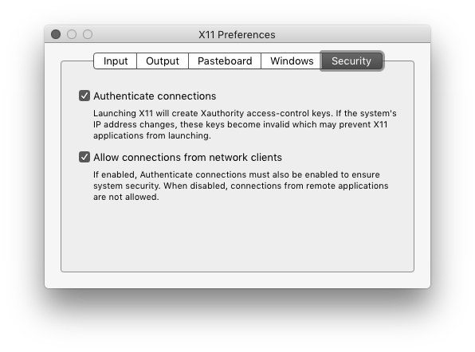

# lrose-soloii Docker Usage

The `ncareol/soloii` **Docker** image is hosted on **Docker Hub**: <https://hub.docker.com/r/ncareol/soloii/>.

## Entrypoint

This image provides an [`entrypoint`](https://docs.docker.com/engine/reference/builder/#entrypoint) that can accept a directory as an argument.

Running the image w/ `-h` or `--help` as argument will display help instructions:

```
docker run ncareol/soloii -h

start soloii
INPUT (OPTIONAL): directory path from which to invoke soloii
```

Passing a directory as an argument will cause the container to `cd` to that directory and then start `soloii`. *E.g.*

```sh
docker run ncareol/soloii /data
```

## X11

For **X11** on **macOS**:

Install [**XQuartz**](https://www.xquartz.org/)

Start **XQuartz**.

Enable **X11** connections:

- Under **Preferences** in **XQuartz**, in the **Security** tab, ensure that the *Authenticate connections* and *Allow connections from network clients* checkboxes are selected.



Determine the IP address of the **macOS** host machine:

```sh
ip=$(ifconfig en0 | grep inet | awk '$1=="inet" {print $2}')
```

## Run

Provide `docker run` w/ the following:

- set the `DISPLAY` for **X11** w/ `-e`
- mount the `~/.Xauthority` file as a volume w/ `-v`
- mount a data volume w/ another `-v`
- specify the Docker image, `ncareol/soloii`
- optionally, specify a path to a data directory within the container, *e.g.* `/data`

*E.g.*:

```sh
docker run \
  -v $HOME/.Xauthority:/root/.Xauthority \
  -e DISPLAY=$ip:0 \
  -v /tmp/.X11-unix:/tmp/.X11-unix \
  -v /Users/ej/rsf:/data \
  ncareol/soloii /data
```

If more than one **X11** server has been running, such as running both **socat** and **Xquartz**, then **Xquartz** may not be running on display number `0`. This can be determined by running `xauth list`:

```
xauth list

myhost/unix:0  MIT-MAGIC-COOKIE-1 ...
myhost/unix:1  MIT-MAGIC-COOKIE-1  ...
myhost.mydomain.edu:1  MIT-MAGIC-COOKIE-1  ...
```

If there are entries other than `:0`, the display number for one of those entries may need to be used.

**Xquartz**' display number can be more explicitly determined by running a more verbose series of commands:

```sh
ps -e | grep 'Xquartz :\d'|grep -v xinit

 2104 ??         0:00.00 /opt/X11/bin/Xquartz :1 -listen tcp -iglx -auth /Users/myuser/.serverauth.1955
```

where the entry immediately after `Xquartz` specifies the display number in this example as `1`.

Based on the above examples w/ `:1`, `DISPLAY` would be set w/ `1` as the display number via:

```sh
  -e DISPLAY=$ip:1
```

### Further information

- [Docker for Mac and GUI applications](https://fredrikaverpil.github.io/2016/07/31/docker-for-mac-and-gui-applications/)
- [Docker Containers on the Desktop](https://blog.jessfraz.com/post/docker-containers-on-the-desktop/)

## Troubleshooting

### Linux

#### "Unable to load font %s"

If `soloii` fails to start and returns an error w/ message *"Unable to load font %s"*, this can be resolved by installing the required fonts on the host.

On **CentOS**, **RHEL**-derived **Linux**, install `ISO8859-1` packages:

```sh
sudo yum install xorg-x11-fonts-ISO8859-1-*
```

##### Ubuntu, Debian and its derivatives

**TODO**
